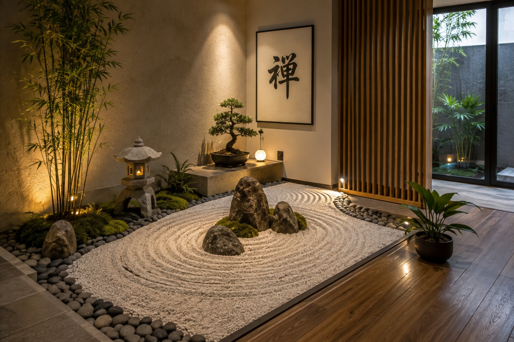

# 🌿 CI.EMME Giardini Zen - Guida Completa al Sito

## 📋 Struttura File Finale

```
ciemme-giardini/
├── index.html                 (Homepage)
├── chi-siamo.html             (Chi Siamo)
├── servizi.html               (Servizi)
├── portfolio.html             (Portfolio dinamico fino a 30 foto)
├── metodo.html                (Il Nostro Metodo)
├── articoli.html              (Articoli dinamici - griglia 20 articoli)
├── articolo1.html             (Template Articolo 1 - DUPLICA QUESTO)
├── articolo2.html             (Articolo 2 - duplicato da articolo1)
├── articolo3.html             (Articolo 3 - duplicato da articolo1)
│   ... fino a articolo20.html
├── faq.html                   (Domande Frequenti)
├── images/
│   ├── portfolio-1.jpg        (Foto Portfolio)
│   ├── portfolio-2.jpg
│   │ ... fino a portfolio-30.jpg
│   └── (placeholder automatico se foto manca)
├── articles/
│   ├── articolo1.jpg          (Foto articoli)
│   ├── articolo2.jpg
│   │ ... fino a articolo20.jpg
│   └── (placeholder automatico se foto manca)
└── css/
    └── (opzionale - stili inline come richiesto)
```

---

## 🚀 PASSO 1: Copia i File Base

Tutti questi file sono pronti e caricabili:
- ✅ index.html
- ✅ chi-siamo.html
- ✅ servizi.html
- ✅ portfolio.html (dinamico - legge fino a 30 foto)
- ✅ metodo.html
- ✅ articoli.html (dinamico - griglia di 20 articoli)
- ✅ faq.html
- ✅ articolo1-TEMPLATE.html (usa questo come base)

---

## 📄 PASSO 2: Creare gli Articoli (20 Total)

### Procedura Semplice:

1. **Apri** `articolo1-TEMPLATE.html` nel tuo editor
2. **Duplica il file** 20 volte e rinomina:
   - articolo1.html
   - articolo2.html
   - articolo3.html
   - ... fino a articolo20.html

3. **Per ogni articolo**, modifica SOLO questi elementi:
   ```html
   <title>Titolo Articolo | CI.EMME Giardini Zen</title>
   
   
   
   <div class="article-meta">
       <span class="article-date">DATA</span>
       <span>Tempo di lettura: X min</span>
   </div>
   
   <h1>TITOLO ARTICOLO</h1>
   <p class="article-intro">Breve introduzione</p>
   
   <!-- Contenuto dell'articolo in <p> tags -->
   ```

### Esempio Articolo 1:
```
Titolo: Come creare un giardino Zen: principi fondamentali
Data: 20 Agosto 2024
Tempo lettura: 5 min
Foto: articles/articolo1.jpg
```

---

## 🖼️ PASSO 3: Caricare le Foto

### Portfolio (fino a 30 foto):
Carica nella cartella `images/`:
- portfolio-1.jpg
- portfolio-2.jpg
- ... fino a portfolio-30.jpg

**Nota:** Se una foto manca, il sito mostra un placeholder automaticamente.

### Articoli (20 foto):
Carica nella cartella `articles/`:
- articolo1.jpg
- articolo2.jpg
- ... fino a articolo20.jpg

**Suggerimento:** Usa foto 250x180px per gli articoli e 800x400px per le singole pagine articoli.

---

## 🎨 PASSO 4: Personalizzazioni Finali

### Google Analytics e Search Console
Nel cookie banner, sostituisci questi placeholder:

**In articoli.html, portfolio.html e articolo1.html:**
```javascript
// Sostituisci G-XXXXXXXXXX con il tuo ID Google Analytics
script.src = 'https://www.googletagmanager.com/gtag/js?id=G-TUOIDSAQUI'
gtag('config', 'G-TUOIDSAQUI');

// Sostituisci XXXXXXXXXXXXX con il tuo token Google Search Console
meta.content = 'TUOTOKEN_VERIFICA_GOOGLE';
```

### Colori (opzionale)
I colori sono definiti in `:root` in ogni HTML:
- `--sage-green: #7a9a7a` (principale)
- `--warm-white: #f5f3f0` (background)
- `--deep-black: #1a1a1a` (testo)

---

## 📱 Feature Già Implementate

✅ **Homepage:**
- Logo bambù SVG verde
- Sezioni cliccabili con link a pagine dedicate
- Bottone "Scopri di più" su ogni sezione
- Menu hamburger mobile
- WhatsApp button fisso in basso a destra
- Call to Action contatti
- Partita IVA nel footer: **03120250166**

✅ **Tutte le Pagine:**
- Cookie banner GDPR compliant
- Footer con contatti e Partita IVA
- WhatsApp button sempre visibile
- Menu navigazione coerente
- Responsive design mobile-first
- Stili inline (nessun CSS esterno)

✅ **Portfolio:**
- Carica dinamicamente fino a 30 foto
- Placeholder automatico se foto manca
- Hover effect con descrizione
- Grid responsive

✅ **Articoli:**
- Griglia di 20 articoli
- Carica foto automaticamente da cartella articles/
- Placeholder per foto mancanti
- Link automatici a articolo1.html, articolo2.html, ecc.
- Pulsante "Scopri di più" su ogni articolo

✅ **Pagine Articoli Individuali:**
- Foto in alto
- Titolo
- Data e tempo lettura
- Testo articolo formattato
- Call to action contatti a fine pagina
- Link "Torna agli articoli"

---

## ⚙️ Configurazione Cookie Banner

Il banner chiede il consenso per:
- Google Analytics (tracking visite)
- Google Search Console (verifica proprietà)
- Cookie di sessione

**Pagine con cookie banner:**
- articoli.html
- portfolio.html
- articolo1.html + duplicati

---

## 📞 Dati Contatto (Già Inseriti)

- **Nome Azienda:** CI.EMME Giardini Zen
- **Telefono:** +39 348 703 6996
- **Email:** Claudio.manutenzioni@gmail.com
- **Indirizzo:** Viale Italia 3, 24060 Villongo (BG)
- **Partita IVA:** 03120250166

---

## 🔗 URL Link Struttura

```
HOME: index.html
├── Chi Siamo → chi-siamo.html
├── Servizi → servizi.html
├── Portfolio → portfolio.html (30 foto)
├── Metodo → metodo.html
├── Articoli → articoli.html (griglia 20)
│   ├── Articolo 1 → articolo1.html
│   ├── Articolo 2 → articolo2.html
│   └── ... articolo20.html
└── FAQ → faq.html

AZIONI:
- WhatsApp: https://wa.me/393487036996?text=...
- Email: Claudio.manutenzioni@gmail.com
- CTA Contatti: #contact (sezione index.html)
```

---

## 📋 Checklist Finale

- [ ] Carica 30 foto portfolio (o meno, placeholder automatico)
- [ ] Carica 20 foto articoli nella cartella articles/
- [ ] Crea/modifica 20 file articolo1.html → articolo20.html
- [ ] Sostituisci Google Analytics ID (G-XXXXXXXXXX)
- [ ] Sostituisci Google Search Console token
- [ ] Testa responsive su mobile
- [ ] Verifica tutti i link
- [ ] Testa WhatsApp button
- [ ] Verifica cookie banner su tutte le pagine
- [ ] Carica sul server/hosting

---

## 🆘 Troubleshooting

**Foto portfolio non appaiono?**
→ Controlla che i file siano in `images/portfolio-1.jpg`, `portfolio-2.jpg`, ecc.
→ Il sito mostra placeholder automaticamente

**Articoli non caricano?**
→ Verifica che gli articoli siano nominati `articolo1.html`, `articolo2.html`, ecc.
→ Le foto devono essere in `articles/articolo1.jpg`, ecc.

**Cookie banner non scompare?**
→ Assicurati che il localStorage sia abilitato nel browser
→ Prova a fare "Accetta tutto"

**Link non funzionano?**
→ Verifica che i file siano nella stessa cartella
→ Usa percorsi relativi (senza / iniziale)

---

## 💡 Note Importanti

1. **Stili Inline:** Tutti gli stili sono inline nei file HTML per semplicità
2. **Responsive:** Automaticamente adatto a mobile (≤768px)
3. **Cookie Compliant:** Banner GDPR su tutte le pagine
4. **Dinamico:** Portfolio e articoli si caricano automaticamente
5. **Fallback:** Se foto manca, mostra placeholder SVG

---

## 📧 Contatti per Supporto

**Partita IVA:** 03120250166
**Email:** Claudio.manutenzioni@gmail.com
**Tel:** +39 348 703 6996
**WhatsApp:** link integrato nel sito

---

**Versione Sito:** 1.0 - Agosto 2024
**Ultimo Aggiornamento:** 24 Agosto 2026